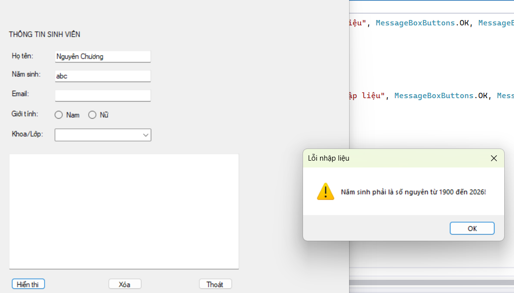
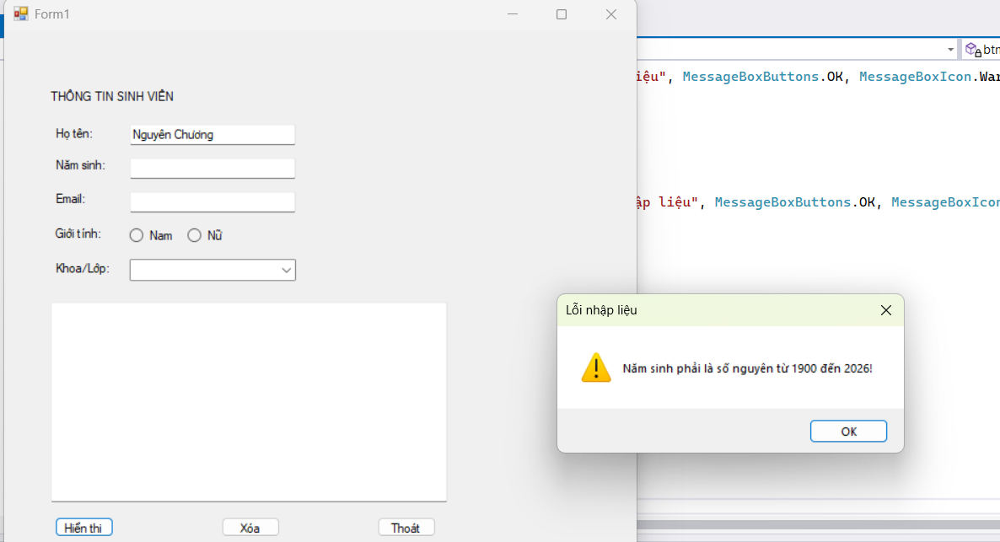
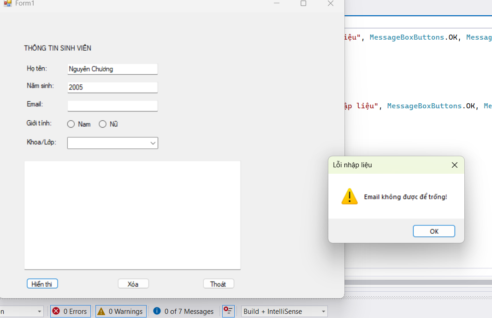
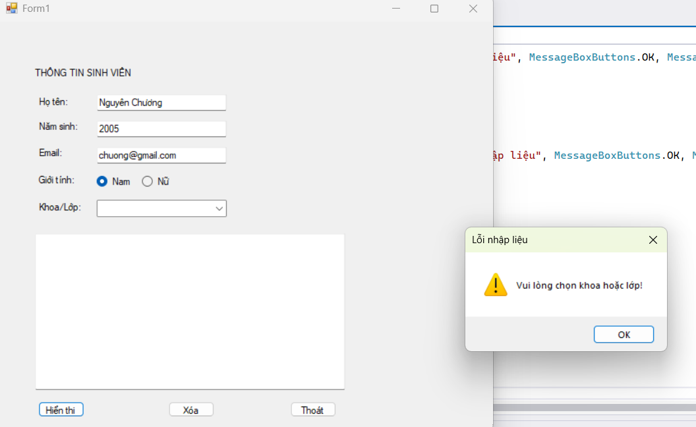
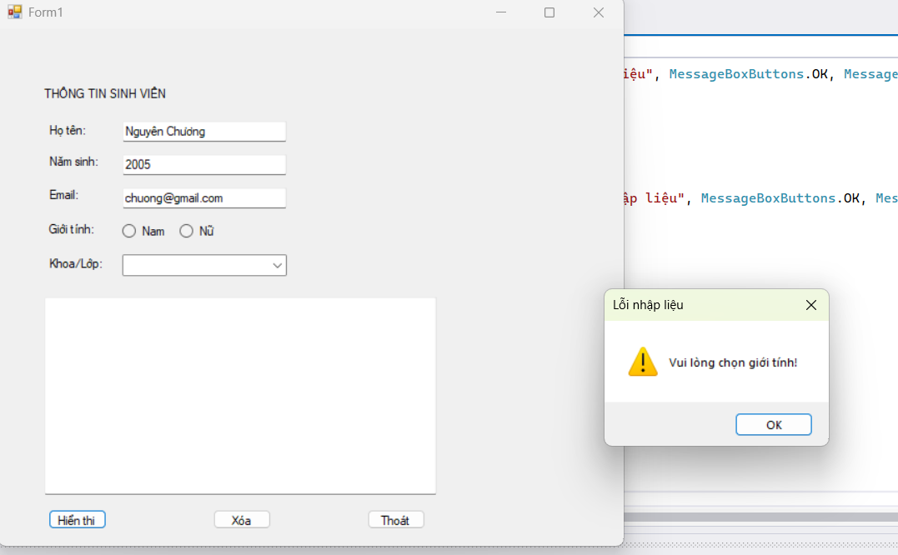
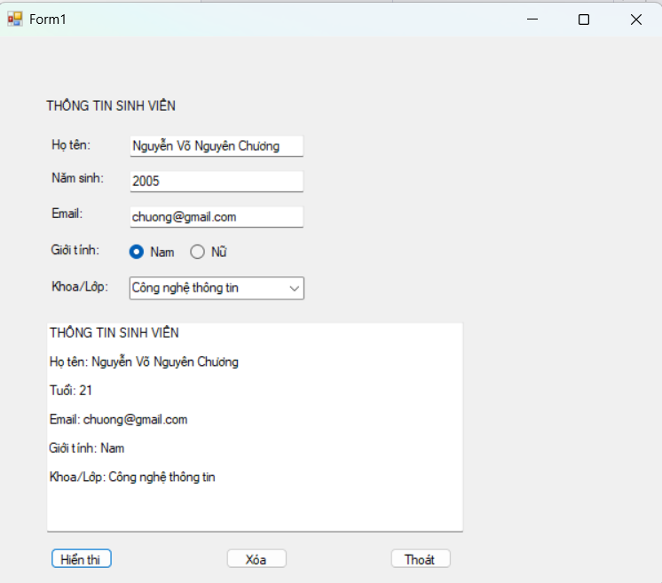
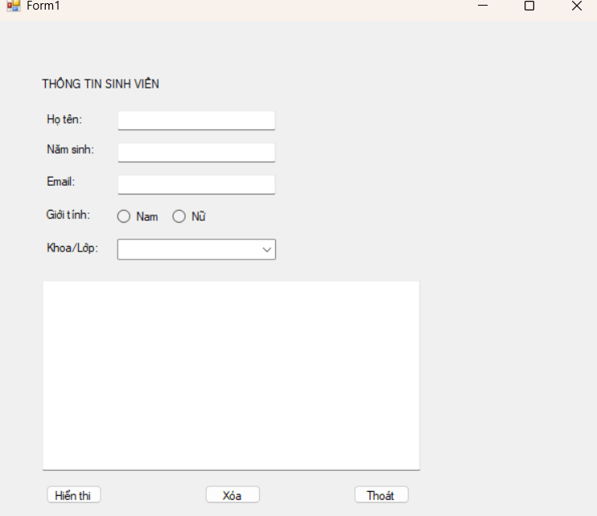
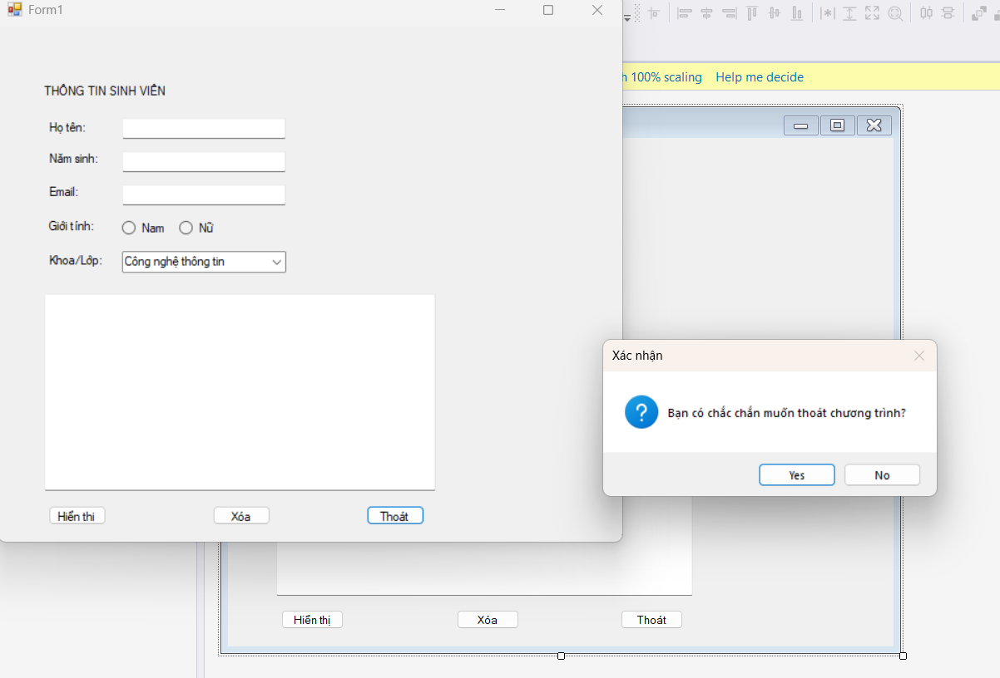

# BÀI LAB 01 - ỨNG DỤNG THÔNG TIN CÁ NHÂN

## 1. Mô tả bài tập

Ứng dụng Windows Forms cho phép nhập thông tin cá nhân của sinh viên (Họ tên, Năm sinh, Email, Giới tính, Khoa/Lớp), kiểm tra tính hợp lệ của dữ liệu đầu vào và hiển thị kết quả tổng hợp.

## 2. Hình ảnh kết quả chạy chương trình

### 2.1. Kiểm tra dữ liệu đầu vào 

Thông báo lỗi khi người dùng bỏ trống hoặc nhập sai định dạng năm sinh:

Thông báo lỗi khi người dùng bỏ trống email:

Thông báo lỗi khi người dùng bỏ trống khoa/lớp:

Thông báo lỗi khi người dùng bỏ trống giới tính:

### 2.2. Hiển thị thông tin thành công

Giao diện sau khi bấm nút \*\*Hiển thị\*\* với dữ liệu hợp lệ:

### 2.3. Sau khi nhấn nút Xóa

### 2.4. Sau khi nhấn nút Thoát

# 2611COMP101904-Lap-trinh-Windows
# MSSV: 49.01.103.010
# Họ và tên: Nguyễn Võ Nguyên Chương
# Lớp: SPTIN.A
# Nhóm: 9

