## BUỔI 2: LAB 02 - C# CƠ BẢN: QUẢN LÝ MẢNG SỐ NGUYÊN

- **Họ và tên:** Nguyễn Võ Nguyên Chương
- **Môi trường:** Visual Studio, C# .NET Console App

---

## 1. Giới thiệu bài toán
Chương trình Console quản lý mảng số nguyên một chiều bằng menu điều khiển tương tác. Sau khi thực hiện xong một chức năng, chương trình tự động quay trở lại menu chính cho đến khi người dùng chọn thoát (chức năng 0). Không cho thực hiện các chức năng xử lý nếu người dùng chưa nhập mảng. Có kiểm tra dữ liệu nhập cho số lượng phần tử và lựa chọn menu. Chương trình không bị dừng bất thường khi người dùng nhập sai lựa chọn menu.

---

## 2. Danh sách chức năng
- **1. Nhập mảng:** Nhập số lượng phần tử n > 0 và giá trị từng phần tử của mảng.
- **2. Xuất mảng:** In toàn bộ phần tử trong mảng ra màn hình.
- **3. Tính tổng:** Tính và xuất tổng các giá trị có trong mảng.
- **4. Tìm max/min:** Tìm và in giá trị lớn nhất, giá trị nhỏ nhất của mảng.
- **5. Đếm chẵn/lẻ:** Đếm số lượng phần tử chẵn và lẻ.
- **6. Sắp xếp tăng dần:** Sắp xếp mảng theo thứ tự từ nhỏ đến lớn bằng thuật toán Interchange Sort và in mảng sau sắp xếp.
- **7. Tìm kiếm:** Nhập vào giá trị x, kiểm tra sự tồn tại và in chỉ số (index bắt đầu từ 0) xuất hiện đầu tiên của x.
- **0. Thoát:** Dừng và thoát khỏi chương trình.

---

## 3. Kiến trúc mã nguồn & Danh sách hàm
Chương trình được chia nhỏ thành các hàm static độc lập để tăng khả năng tái sử dụng:

| Tên phương thức | Kiểu trả về | Tham số | Mô tả chức năng |
| :--- | :--- | :--- | :--- |
| `NhapSoNguyen` | `int` | `string message` | Nhập và bắt lỗi số nguyên (tránh văng ứng dụng) |
| `NhapSoNguyenDuong` | `int` | `string message` | Bắt buộc nhập số nguyên dương (n > 0) |
| `NhapMang` | `int[]` | Không | Khởi tạo mảng và nhập từng phần tử |
| `XuatMang` | `void` | `int[] a` | Hiển thị mảng ra màn hình |
| `TinhTong` | `int` | `int[] a` | Tính tổng các phần tử trong mảng |
| `TimMax` | `int` | `int[] a` | Tìm phần tử lớn nhất |
| `TimMin` | `int` | `int[] a` | Tìm phần tử nhỏ nhất |
| `DemChan` | `int` | `int[] a` | Đếm số lượng phần tử chẵn |
| `DemLe` | `int` | `int[] a` | Đếm số lượng phần tử lẻ |
| `SapXepTangDan` | `void` | `int[] a` | Hoán đổi phần tử để sắp xếp mảng tăng dần |
| `TimKiem` | `int` | `int[] a, int x` | Tìm chỉ số đầu tiên của x (trả về -1 nếu không có) |

---

## 4. Xử lý ngoại lệ & Ràng buộc
- **Chặn lỗi chưa nhập mảng:** Nếu người dùng chọn chức năng từ 2 đến 7 khi mảng đang ở trạng thái `null`, chương trình sẽ cảnh báo và yêu cầu chạy chức năng 1 trước.
- **Kiểm soát dữ liệu đầu vào:** Sử dụng `int.TryParse` để người dùng nhập chữ, chuỗi rỗng hay ký tự lạ vào menu/phần tử mảng thì chương trình không bị crash.

---

## 5. Kết quả kiểm thử (Test Cases)

### Test Case: Mảng 5 phần tử `3 5 1 9 -7`
- Tổng: `11`
- Max: `9`, Min: `-7`
- Chẵn: `0`, Lẻ: `5`
- Sắp xếp tăng dần: `-7 1 3 5 9`
- Tìm kiếm x = -7: Tìm thấy tại vị trí `0` (tính từ 0)
- Tìm kiếm x = 10: Không tìm thấy

---

## 6. Hình ảnh minh chứng chạy chương trình thực hiện các chức năng

- **Menu chính và nhập mảng:**
  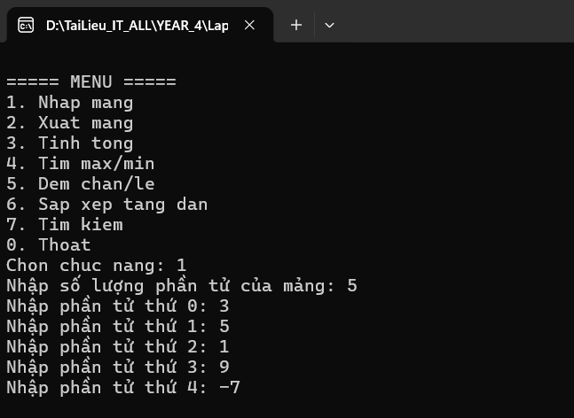

- **Xuất mảng:**
  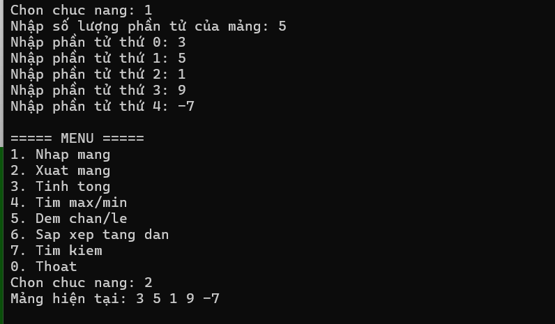

- **Tính tổng:**
  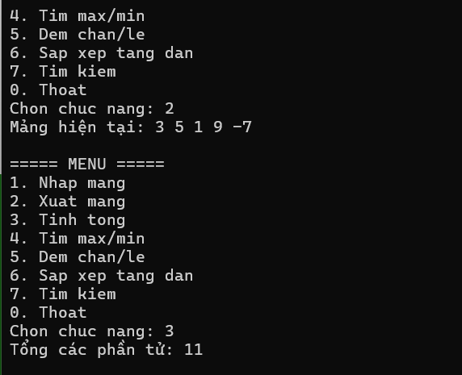

- **Tìm Max Min:**
  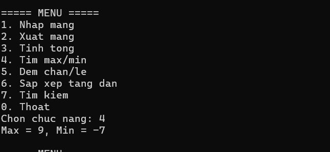

- **Đếm chẵn lẻ:**
  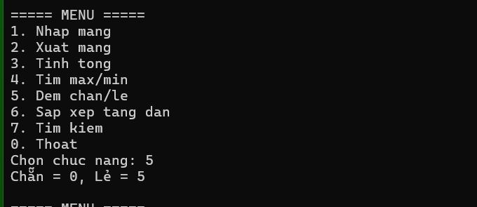

- **Sắp xếp tăng dần:**
  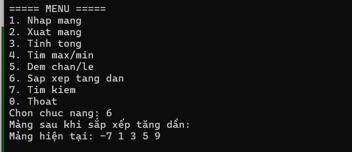

- **Tìm kiếm giá trị:**
  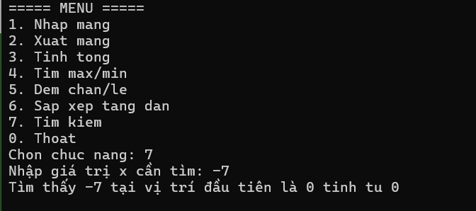

- **Thoát chương trình:**
  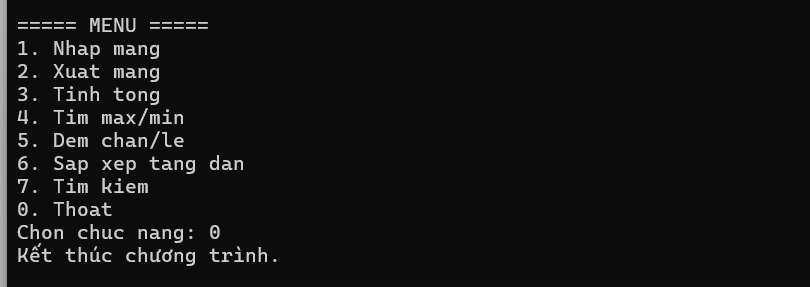

- **Lỗi chọn chức năng khác 0 - 7:**
  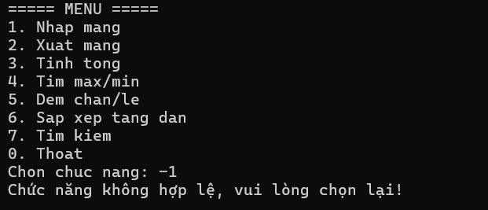

- **Lỗi chưa nhập mảng:**
  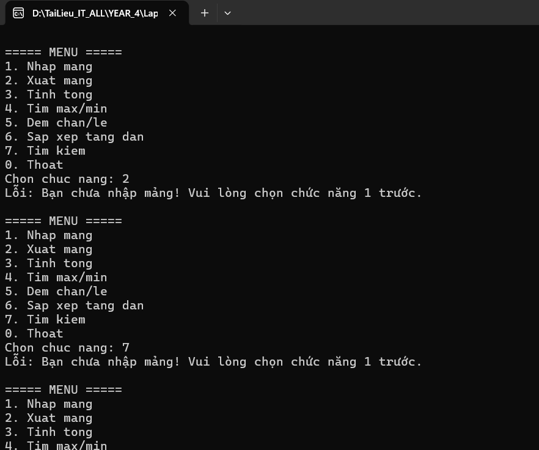

- **Lỗi nhập số lượng phần tử < 0:**
  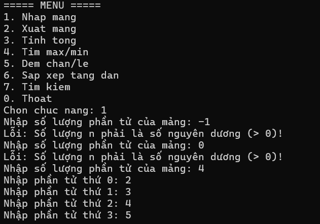