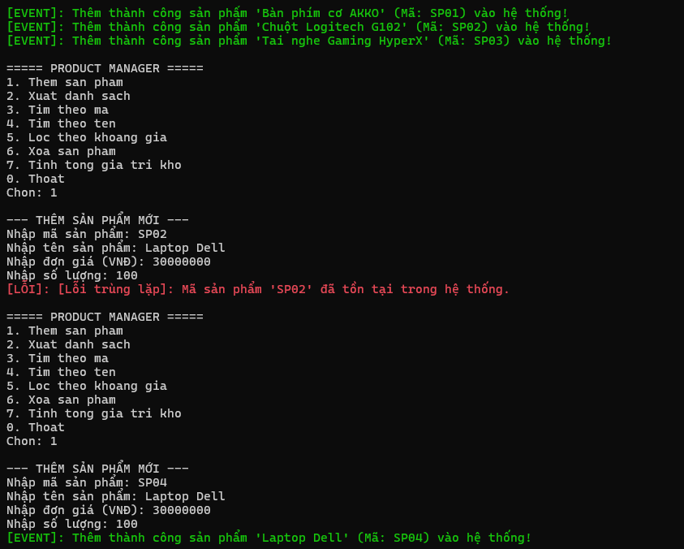
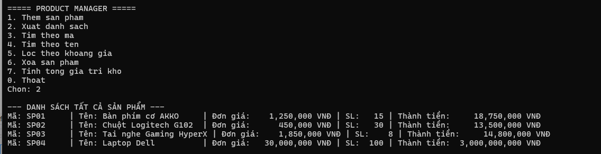
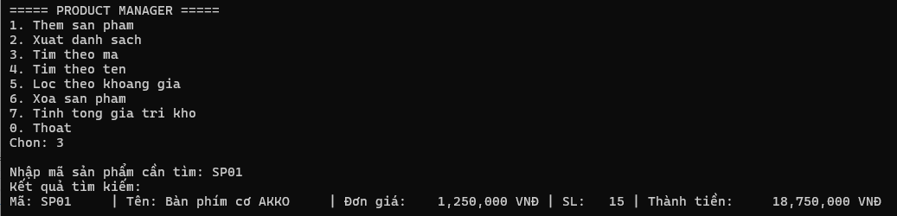
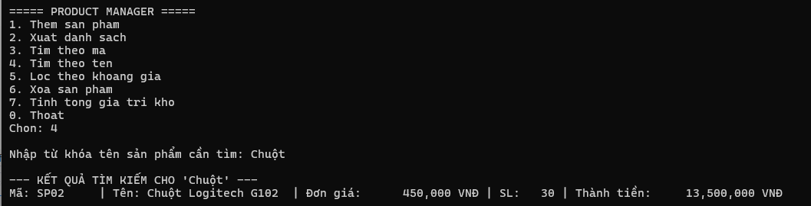
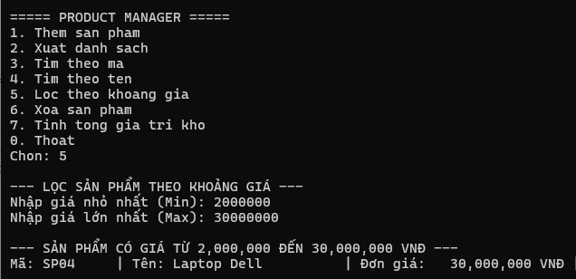
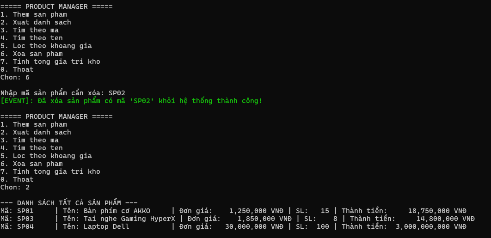
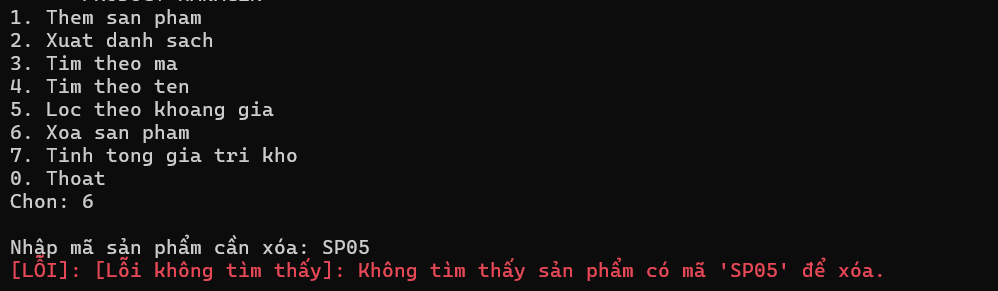
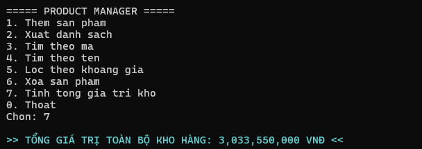
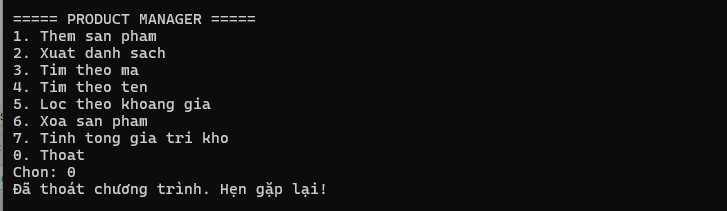

# BUỔI 4 - LAB 04: QUẢN LÝ SẢN PHẨM (EXCEPTION, DELEGATE, EVENT, FUNC & GENERIC)

## 1. Giới thiệu tổng quan
Dự án Console Application được xây dựng bằng ngôn ngữ C# (.NET) nhằm hiện thực hóa hệ thống quản lý kho sản phẩm trong bộ nhớ[cite: 5]. Chương trình kết hợp các kỹ thuật nâng cao trong C#: generic collection repository, ngoại lệ tùy biến (custom exceptions), cơ chế thông báo bằng Action event, xử lý biểu thức điều kiện qua delegate `Func<T, bool>` và kiểm soát lỗi nhập liệu chống crash[cite: 5].

---

## 2. Kiến trúc mã nguồn & Kỹ thuật cài đặt

Dự án được phân tách thành 6 tệp mã nguồn độc lập nhằm bảo đảm tính đơn nhiệm và dễ bảo trì[cite: 5]:

### 2.1. Interface `IEntity.cs`
- Định nghĩa giao diện định danh với thuộc tính đọc: `string Id { get; }`[cite: 5].
- Đóng vai trò là ràng buộc kiểu dữ liệu cho Generic Repository (`where T : IEntity`)[cite: 5].

### 2.2. Lớp thực thể `Product.cs`
- Triển khai interface `IEntity` (ánh xạ `Id` qua `MaSP`)[cite: 5].
- Các thuộc tính: `MaSP`, `TenSP`, `Price` (đơn giá), `Quantity` (số lượng)[cite: 5].
- Kiểm tra hợp lệ dữ liệu chặt chẽ qua property setter: ném `ArgumentException` nếu `Price` hoặc `Quantity` mang giá trị âm[cite: 5].
- Ghi đè phương thức `ToString()` để định dạng chuỗi hiển thị sản phẩm đẹp mắt theo cột[cite: 5].

### 2.3. Các ngoại lệ tùy biến `Exceptions.cs`
- `DuplicateProductException`: Kế thừa từ `Exception`, được ném ra khi cố tình thêm một sản phẩm có mã đã tồn tại trong kho[cite: 5].
- `ProductNotFoundException`: Kế thừa từ `Exception`, được ném ra khi tìm kiếm hoặc thực hiện xóa một sản phẩm không tồn tại[cite: 5].

### 2.4. Lớp lưu trữ dữ liệu dùng chung `Repository<T>` (Generic Class)
- Áp dụng generic constraint: `where T : IEntity`[cite: 5].
- Quản lý danh sách đối tượng bằng `List<T>` nội bộ[cite: 5].
- Cung cấp các phương thức CRUD nền tảng:
  - `Add(T item)`: Thêm một thực thể vào kho dữ liệu[cite: 5].
  - `Remove(string id)`: Xóa thực thể theo mã định danh[cite: 5].
  - `FindById(string id)`: Tìm kiếm chính xác đối tượng dựa vào `Id`[cite: 5].
  - `Find(Func<T, bool> predicate)`: Tìm kiếm và lọc linh hoạt các phần tử thỏa mãn biểu thức logic[cite: 5].
  - `GetAll()`: Trả về bản sao danh sách toàn bộ phần tử trong kho[cite: 5].

### 2.5. Lớp xử lý nghiệp vụ `ProductService.cs`
- Đóng gói đối tượng `Repository<Product>`[cite: 5].
- Định nghĩa 2 Action events để phát tín hiệu khi trạng thái kho thay đổi[cite: 5]:
  - `event Action<Product> OnProductAdded`: Kích hoạt khi một sản phẩm mới được thêm thành công vào kho[cite: 5].
  - `event Action<string> OnProductRemoved`: Kích hoạt khi xóa bỏ thành công một sản phẩm[cite: 5].
- Chức năng lọc sản phẩm theo khoảng giá sử dụng delegate `Func<Product, bool>`[cite: 5].
- Tính toán tổng giá trị kho hàng bằng công thức: Tổng = Đơn giá × Số lượng của tất cả sản phẩm[cite: 5].

### 2.6. Lớp giao diện điều khiển `Program.cs`
- Thiết lập Menu dạng Console cho phép người dùng tương tác liên tục[cite: 5].
- Đăng ký lắng nghe các sự kiện (`OnProductAdded`, `OnProductRemoved`) và in thông báo phản hồi màu xanh lá ra màn hình.
- Bắt và phân loại ngoại lệ trong các khối `try - catch`: tách biệt rõ ràng giữa lỗi trùng lặp, lỗi không tìm thấy và lỗi hệ thống[cite: 5].
- Cơ chế chống dừng đột ngột (Fail-safe Input): Toàn bộ thao tác nhập menu, đơn giá, số lượng đều kiểm tra qua `TryParse`, chuyển đổi linh hoạt dấu phẩy sang dấu chấm, ngăn ngừa crash ứng dụng khi gõ sai định dạng[cite: 5].

---

## 3. Danh mục chức năng của chương trình

| Số | Chức năng | Mô tả chi tiết |
|:---:|:---|:---|
| **1** | Thêm sản phẩm | Nhập mã, tên, giá, số lượng. Tự động kiểm tra mã trống, trùng mã và ném ngoại lệ khi vi phạm[cite: 5]. |
| **2** | Xuất danh sách | Hiển thị toàn bộ kho hàng. Thông báo nếu kho đang rỗng[cite: 5]. |
| **3** | Tìm theo mã | Tra cứu nhanh thông tin sản phẩm dựa vào mã[cite: 5]. |
| **4** | Tìm theo tên | Tìm kiếm gần đúng theo từ khóa tên sản phẩm[cite: 5]. |
| **5** | Lọc theo khoảng giá | Nhập khoảng `[Min, Max]`, sử dụng `Func<Product, bool>` để trích xuất danh sách phù hợp[cite: 5]. |
| **6** | Xóa sản phẩm | Nhập mã sản phẩm, xóa và kích hoạt event thông báo[cite: 5]. |
| **7** | Tính tổng giá trị kho | Tính và xuất tổng số tiền của toàn bộ hàng hóa lưu kho[cite: 5]. |
| **0** | Thoát | Dừng và thoát khỏi chương trình[cite: 5]. |

---

## 4. Hướng dẫn cài đặt và chạy ứng dụng

1. Khởi động **Visual Studio 2022**[cite: 5].
2. Mở file solution (`.sln`) thuộc thư mục `Lab04`.
3. Nhấn tổ hợp phím **Ctrl + F5** để biên dịch và chạy ứng dụng Console.
4. Điều khiển theo các phím số từ `0` đến `7` hiển thị trên màn hình[cite: 5].

---

## 5. Kết quả thực nghiệm và Minh họa chức năng

1. Menu điều khiển, hiển thị danh sách sản phẩm ban đầu và thêm sản phẩm mới kích hoạt Event, Kiểm tra bắt ngoại lệ khi nhập trùng mã sản phẩm (DuplicateProductException):

2. Xuất danh sách sản phẩm:

3. Tìm kiếm sản phẩm theo mã:

4. Tìm kiếm sản phẩm theo từ khóa tên:

5. Lọc sản phẩm theo khoảng giá với `Func<Product, bool>`:

6. Xóa sản phẩm thành công kèm Event thông báo:

7. Bắt ngoại lệ khi xóa mã sản phẩm không tồn tại (ProductNotFoundException):

8. Tính toán tổng giá trị tồn kho:

9. Thoát chương trình:
