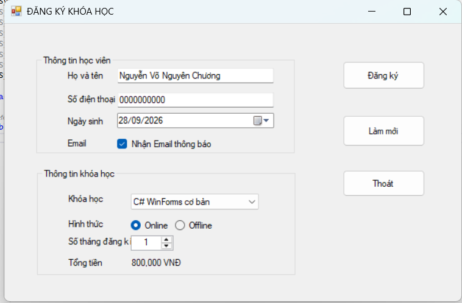
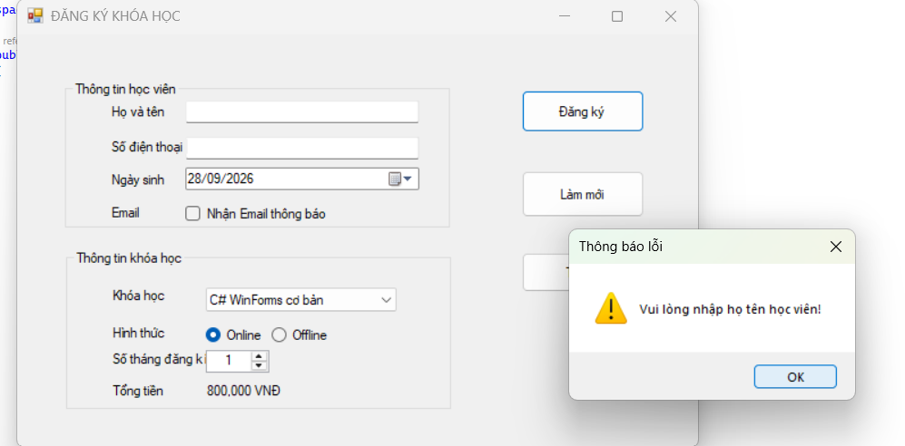
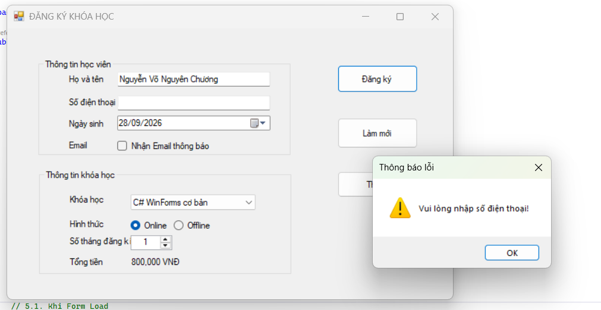
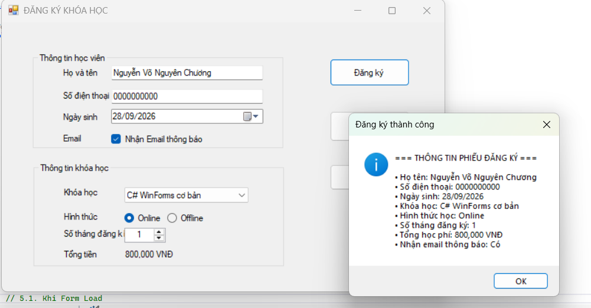
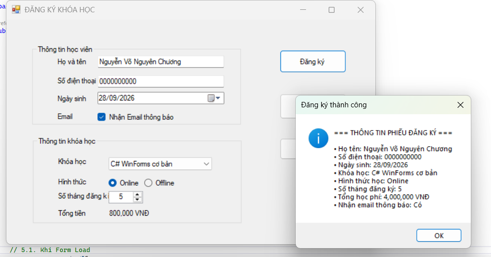
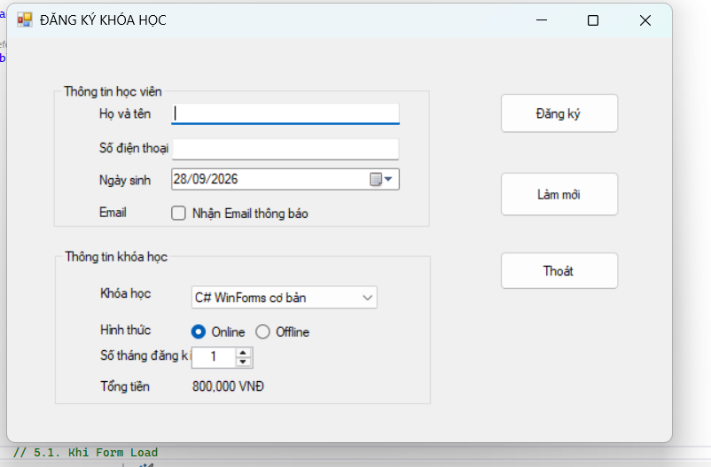
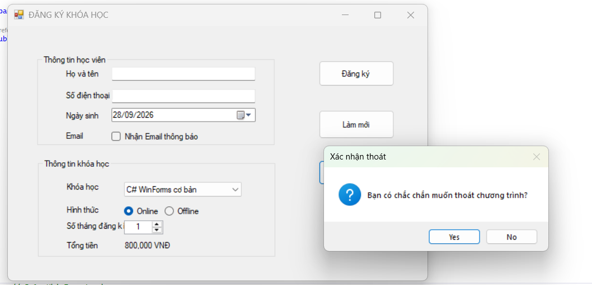

# BUỔI 5 - LAB 05: ĐĂNG KÝ KHÓA HỌC (WINDOWS FORMS CƠ BẢN)

## 1. Giới thiệu tổng quan
Ứng dụng desktop **CourseRegistrationApp** được xây dựng bằng C# Windows Forms (.NET) nhằm hỗ trợ người dùng đăng ký các khóa học trực tuyến hoặc trực tiếp. Chương trình tập trung vào việc thiết kế giao diện bằng Form Designer, gom nhóm dữ liệu bằng GroupBox, đặt tên control theo đúng quy ước, xử lý tương tác qua các sự kiện (Event-driven Programming) và kiểm tra tính hợp lệ của dữ liệu đầu vào.

---

## 2. Kiến trúc & Thiết kế giao diện

Chương trình được thiết kế giao diện với tiêu đề **ĐĂNG KÝ KHÓA HỌC**, chia thành 2 vùng thông tin chính bằng GroupBox và 1 khu vực nút chức năng:

### 2.1. Nhóm thông tin học viên (`GroupBox 1`)
- `txtHoTen` (TextBox): Nhập họ tên học viên.
- `txtSoDienThoai` (TextBox): Nhập số điện thoại liên hệ.
- `dtpNgaySinh` (DateTimePicker): Chọn ngày tháng năm sinh theo định dạng `dd/MM/yyyy`.
- `chkNhanEmail` (CheckBox): Tùy chọn đăng ký nhận email thông báo.

### 2.2. Nhóm thông tin khóa học (`GroupBox 2`)
- `cboKhoaHoc` (ComboBox): Danh sách các khóa học hiện có.
- `radOnline`, `radOffline` (RadioButton): Chọn hình thức học (Online hoặc Trực tiếp).
- `numSoThang` (NumericUpDown): Số tháng đăng ký học (giới hạn từ 1 đến 12 tháng).
- `lblTongTien` (Label): Hiển thị tổng học phí tạm tính.

### 2.3. Khu vực nút điều khiển
- `btnDangKy` (Button): Kiểm tra thông tin và xuất phiếu đăng ký qua MessageBox.
- `btnLamMoi` (Button): Xóa toàn bộ dữ liệu trên form và thiết lập lại trạng thái ban đầu.
- `btnThoat` (Button): Hiển thị hộp thoại xác nhận trước khi đóng ứng dụng.

---

## 3. Danh mục dữ liệu khóa học

Bảng dữ liệu khóa học được nạp tự động vào ComboBox khi mở ứng dụng:

| Khóa học | Học phí / tháng |
| :--- | :--- |
| C# WinForms cơ bản | 800.000 VNĐ |
| SQL Server cơ bản | 700.000 VNĐ |
| Web Frontend cơ bản | 750.000 VNĐ |
| Lập trình Python cơ bản | 650.000 VNĐ |

---

## 4. Xử lý logic & Sự kiện

1. **Khởi tạo form (`Form1_Load`)**:
   - Tự động nạp danh sách 4 khóa học vào `cboKhoaHoc`.
   - Thiết lập mặc định chọn khóa học đầu tiên và hình thức học Online.
   - Cài đặt `numSoThang` có giá trị tối thiểu là 1, tối đa là 12 và mặc định là 1.
   - Tính toán và hiển thị ngay tổng tiền học phí ban đầu.

2. **Tự động cập nhật học phí**:
   - Bắt sự kiện `SelectedIndexChanged` của `cboKhoaHoc` và `ValueChanged` của `numSoThang`.
   - Công thức: `Tổng học phí = Học phí 1 tháng × Số tháng`.

3. **Xử lý nút Đăng ký (`btnDangKy_Click`)**:
   - Kiểm tra ràng buộc dữ liệu: bắt buộc nhập `txtHoTen` và `txtSoDienThoai` (không được để trống).
   - Xuất thông báo dạng MessageBox hiển thị toàn bộ phiếu đăng ký bao gồm: Họ tên, số điện thoại, ngày sinh, tên khóa học, hình thức học, số tháng, tổng học phí và trạng thái nhận email.

4. **Xử lý nút Làm mới (`btnLamMoi_Click`)**:
   - Xóa trắng ô họ tên và số điện thoại.
   - Đặt lại ngày sinh về ngày hiện tại, bỏ chọn nhận email.
   - Đặt lại khóa học đầu tiên, hình thức Online và số tháng là 1.
   - Di chuyển con trỏ nhập liệu về ô họ tên (`txtHoTen.Focus()`).

5. **Xử lý nút Thoát (`btnThoat_Click`)**:
   - Hiển thị hộp thoại `MessageBox.Show` với lựa chọn `Yes/No` hỏi xác nhận thoát.
   - Chỉ đóng ứng dụng khi người dùng bấm `Yes`.

---

## 5. Kết quả thực nghiệm và Minh họa chức năng

1. Giao diện chương trình:

2. Bắt lỗi để trống họ tên học viên:

3. Bắt lỗi để trống số điện thoại:

4. Tự động tính học phí khi đổi khóa học và số tháng:

5. Thao tác nút Làm mới (Reset form):

6. Hộp thoại xác nhận khi bấm nút Thoát:

