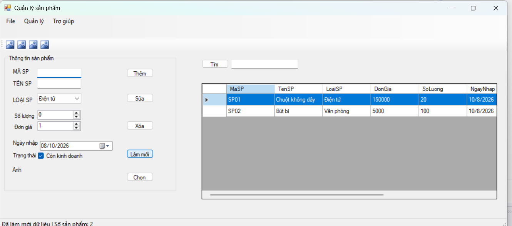
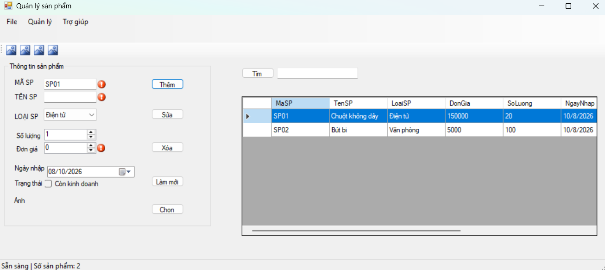
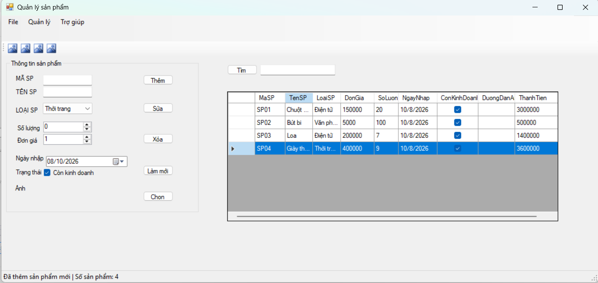
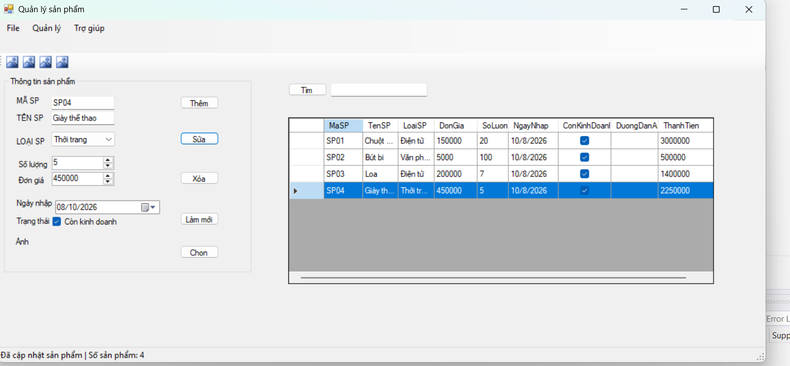
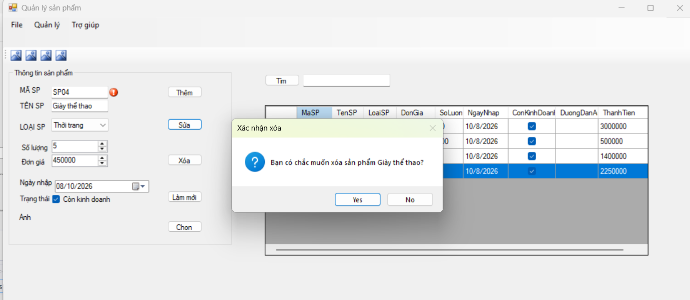
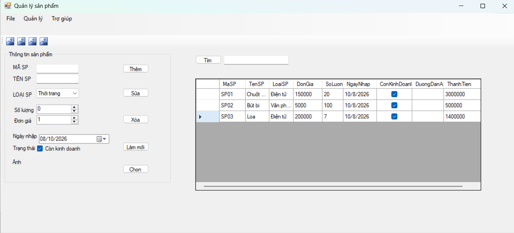
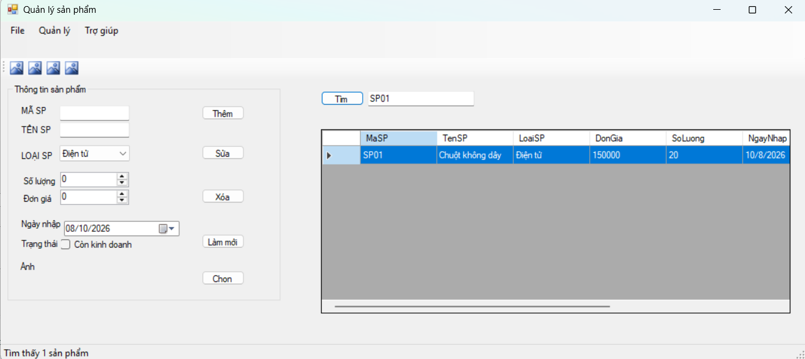
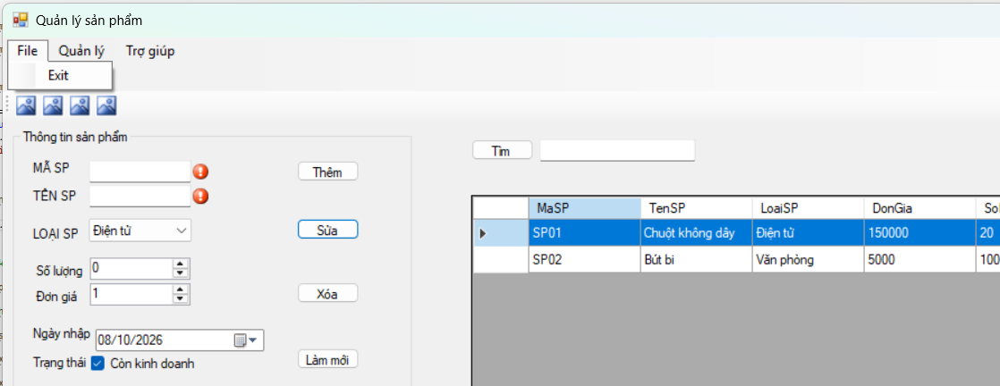
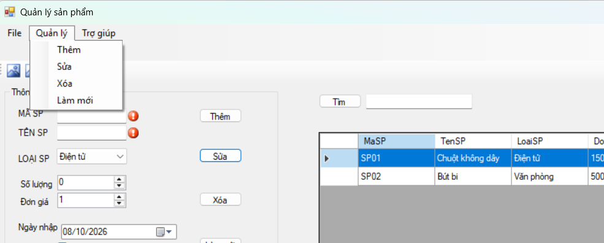
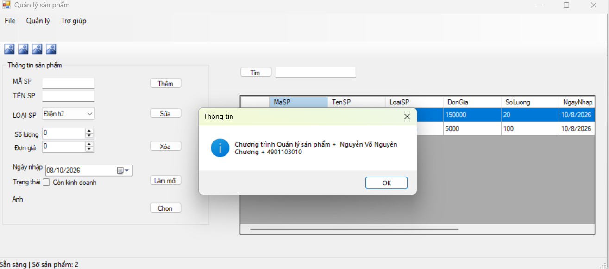

# LAB 05 - WINDOWS FORMS NÂNG CAO VÀ DATAGRIDVIEW

## 1. Giới thiệu tổng quan
Ứng dụng **ProductManager** được xây dựng trên nền tảng C# Windows Forms (.NET) nhằm hỗ trợ quản lý danh sách sản phẩm trong bộ nhớ (In-Memory Management). Chương trình áp dụng mô hình liên kết dữ liệu qua `BindingList<T>` và `BindingSource`, hỗ trợ đầy đủ các thao tác CRUD (Thêm, Sửa, Xóa, Tìm kiếm), kiểm tra ràng buộc bằng `ErrorProvider` và tích hợp các thanh điều hướng chuẩn WinForms như `MenuStrip`, `ToolStrip`, `StatusStrip` và `ContextMenuStrip`.

---

## 2. Kiến trúc & Cấu trúc lớp

Chương trình được tổ chức rõ ràng với lớp mô hình dữ liệu riêng biệt và giao diện điều khiển:

### 2.1. Lớp thực thể `Product.cs`
- `MaSP` (string): Mã sản phẩm (định danh duy nhất).
- `TenSP` (string): Tên sản phẩm.
- `LoaiSP` (string): Loại sản phẩm (Điện tử, Văn phòng, Gia dụng, Thời trang).
- `DonGia` (decimal): Đơn giá bán.
- `SoLuong` (int): Số lượng tồn kho.
- `NgayNhap` (DateTime): Ngày nhập hàng.
- `ConKinhDoanh` (bool): Trạng thái kinh doanh.
- `DuongDanAnh` (string): Đường dẫn tệp ảnh sản phẩm.
- `ThanhTien` (decimal - Read-only): Thuộc tính tự động tính toán (`ThanhTien = DonGia * SoLuong`).

### 2.2. Màn hình giao diện `FrmProduct.cs`
- **MenuStrip (`msMain`)**: Hệ thống menu điều hướng chính (File, Quản lý, Trợ giúp).
- **ToolStrip (`tsMain`)**: Thanh công cụ chứa các nút thao tác nhanh (Thêm, Sửa, Xóa, Làm mới).
- **StatusStrip (`ssStatus`)**: Thanh trạng thái hiển thị tiến trình thực thi và tổng số lượng sản phẩm.
- **DataGridView (`dgvProducts`)**: Hiển thị danh sách sản phẩm dạng bảng với các thiết lập an toàn (`ReadOnly = true`, `SelectionMode = FullRowSelect`, `MultiSelect = false`).
- **ContextMenuStrip (`cmsProduct`)**: Menu chuột phải trên bảng dữ liệu (Sửa, Xóa, Xem chi tiết).
- **ErrorProvider (`errorProvider1`)**: Hiển thị cảnh báo trực quan tại ô nhập liệu khi dữ liệu không hợp lệ.

---

## 3. Danh mục chức năng của chương trình

| STT | Chức năng | Mô tả chi tiết |
| :---: | :---| :---|
| **1** | Load Form | Nạp danh sách loại sản phẩm, khởi tạo dữ liệu mẫu và hiển thị lên `DataGridView`. |
| **2** | Thêm sản phẩm | Kiểm tra dữ liệu rỗng, kiểm tra trùng mã sản phẩm trước khi thêm mới. |
| **3** | Sửa sản phẩm | Chọn một dòng trên DataGridView, cập nhật lại thông tin sản phẩm đã chọn. |
| **4** | Xóa sản phẩm | Hiển thị hộp thoại `MessageBox` hỏi xác nhận trước khi xóa sản phẩm khỏi hệ thống. |
| **5** | Tìm kiếm | Tìm kiếm gần đúng theo mã hoặc tên sản phẩm (không phân biệt chữ hoa/thường). |
| **6** | Làm mới | Xóa trắng nội dung nhập, bỏ các lỗi `ErrorProvider` và hiển thị lại toàn bộ danh sách. |
| **7** | Chọn ảnh | Sử dụng `OpenFileDialog` để chọn tệp hình ảnh và hiển thị trong `PictureBox`. |
| **8** | StatusStrip | Cập nhật thông báo trạng thái và số lượng sản phẩm realtime sau mỗi thao tác. |

---

## 4. Hướng dẫn cài đặt và chạy ứng dụng

1. Khởi động **Visual Studio 2022**.
2. Mở file solution (`.sln`) thuộc thư mục `ProductManager`.
3. Nhấn tổ hợp phím **Ctrl + F5** (hoặc phím **F5**) để biên dịch và chạy ứng dụng.
4. Thao tác trực tiếp trên giao diện hoặc sử dụng thanh công cụ `ToolStrip` / Menu chuột phải `ContextMenuStrip`.

---

## 5. Kết quả thực nghiệm và Minh họa chức năng

1. Giao diện chính khi nạp danh sách sản phẩm ban đầu:

2. Bắt lỗi nhập liệu bằng ErrorProvider 

3. Thao tác Thêm, Sửa và Xóa sản phẩm:

4. Lựa chọn tệp ảnh minh họa bằng OpenFileDialog:

5. Tìm kiếm sản phẩm theo từ khóa mã hoặc tên:

6. Menu:

